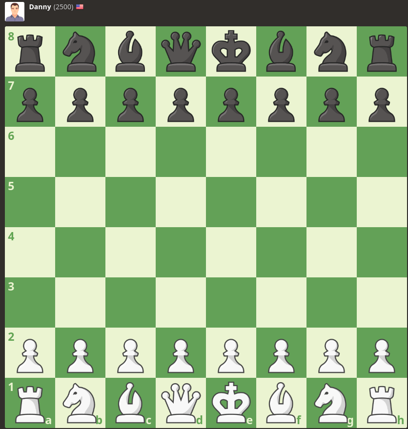

### Chess bot for chess.com



This is chess bot for chess.com based on stokfish.

## Installation

### Requirments:

* [stockfish](https://stockfishchess.org/)
* [python](https://www.python.org/)
* [chromedriver](https://chromedriver.chromium.org/)

## Preparation:

```bash
pip install -r requirements.txt
```

### Usage:

```bash
cd chess_bot
python main.py
```
